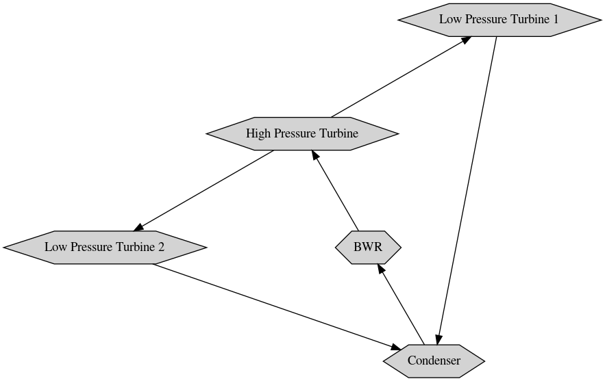

# [SciPy Conference 2020](https://www.scipy2020.scipy.org/schedule)

First online conference; July 6-12 2020.

View the poster on `NBViewer`: 

[**Balance of Plant Network Simulation for a Boiling Water Nuclear Reactor**](https://www.scipy2020.scipy.org/virtual-poster-session)

 >Austin Rotker and [Valmor F. de Almeida](https://github.com/dealmeidavf)  
 >Dept. of Chemical Engineering (Nuclear Program)  
 >University of Massachusetts Lowell, USA  

|  |
|---|
| |
| 
<b>Balance of plant network.</b>
 |

References:

 + [Cortix](https://cortix.org/)
 + [Eng-4350: Nuclear Reactor Engineering: course notes](https://github.com/dpploy/engy-4350)
 + [IAPWS 97 Standards](http://www.iapws.org/relguide/IF97-Rev.html)
 + [IAPWS PyPi Library](https://pypi.org/project/iapws/)
 + Nuclear Energy Conversion, M. M. El-Wakil, ANS, 1982, 666 pp.
